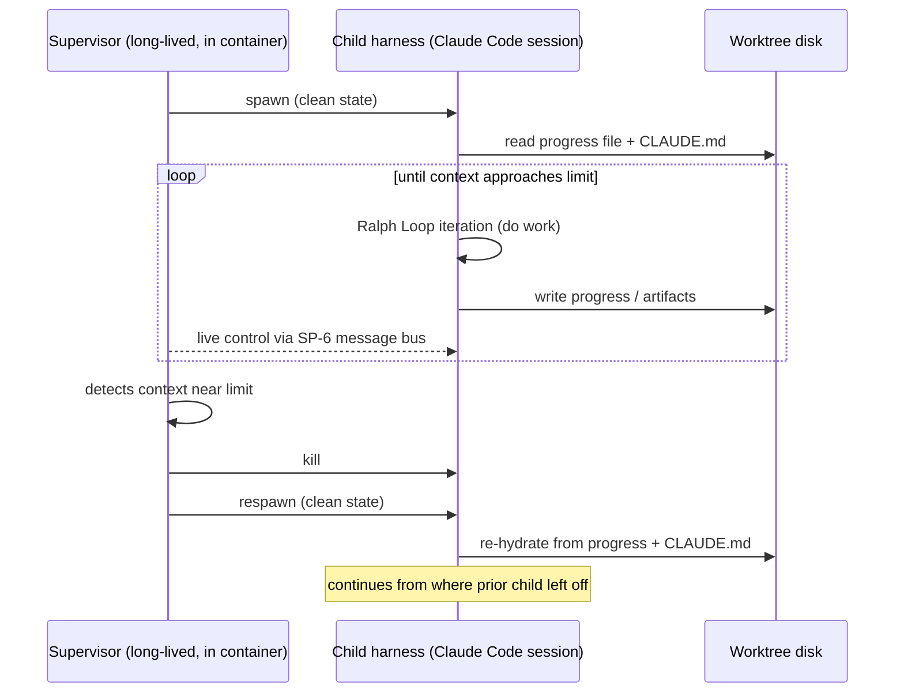
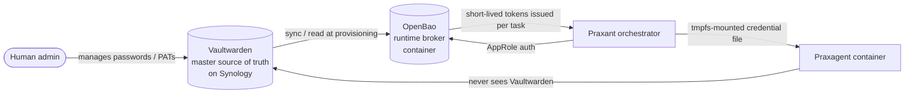
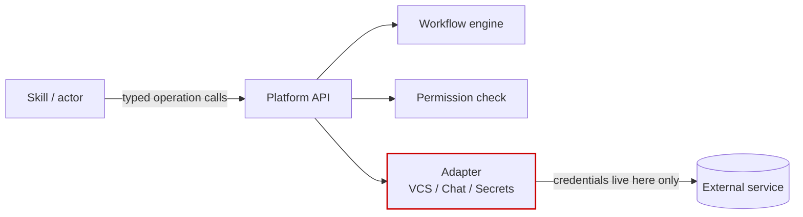
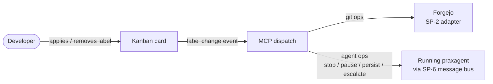

# Praxant — Project Specs

**Project name:** Praxant
**Domain:** praxant.ai (reserved 2026-04-27)
**GitHub organization:** [github.com/praxant-ai](https://github.com/praxant-ai) (registered 2026-04-27 — `praxant` was taken; `praxant-ai` mirrors the domain TLD)
**Repo convention:** `github.com/praxant-ai/<product>` (e.g., `github.com/praxant-ai/praxagent` for the v1 agent orchestration product)
**Tagline working draft:** *"Local orchestration for autonomous coding agents."* (final tagline to be refined during SP-A)
**Status:** Draft — pending review
**Date:** 2026-04-27
**Origin:** Consolidated from architecture brainstorm conversation
**Owner:** Project maintainer (name TBD — to be filled during SP-A)

---

## About the name

**Praxant** is a coined word combining:

| Component | Origin | Meaning |
|---|---|---|
| **Prax-** | Greek πρᾶξις (*praxis*) | Action, deed, doing — putting theory into practical work. Aristotle's term for action requiring practical wisdom (*phronesis*). |
| **-ant** | Latin *-ans, -antem* (present participle) | "One who does X." Forms agent nouns: assistant, participant, consultant. |

Literal meaning: **"one who acts"** — the precise function of an autonomous coding agent.

The name signals competence, action with judgment, and intellectual depth without being pretentious. It avoids the failure modes of other candidates (electrical/industrial overtones, religious/political authority connotations, negative meanings in other languages, personal-name collisions). It transliterates cleanly across major scripts, is **easy to pronounce** in any language (`PRAK-sant`, two syllables, hard consonants), and reads as "serious infrastructure" rather than "trendy startup" — matching the sovereign/durable positioning.

### Praxagent — terminology for agent instances

The platform terminology distinguishes between:

| Term | Meaning |
|---|---|
| **Praxant** | The platform / project / orchestration system as a whole |
| **Praxagent** | A single agent instance running under Praxant supervision — a containerized worker with the full Praxant wrapper (Ralph Loop with caps, message bus integration, council eligibility, structured output capture) |
| **agent runtime** | The underlying CLI being orchestrated (Claude Code, Codex, OpenCode, Gemini CLI, etc.) |

The distinction matters because it captures what the platform actually adds:

- A **raw Claude Code session** = an agent CLI running standalone, no supervision, no caps, no message bus
- A **Praxagent** = the same Claude Code (or any other supported runtime) wrapped with Praxant's container isolation, iteration caps, token budgets, message-bus connectivity, and review-council participation

Usage in docs and conversation:

- *"When a Forgejo issue is assigned to a Praxant bot, the orchestrator dispatches a praxagent in a fresh container..."*
- *"Multiple praxagents can run in parallel (capped by the concurrency setting)."*
- *"Each praxagent reads from the per-task message bus between iterations."*
- *"The review council dispatches N praxagents (one per reviewer model) against the same PR."*

This gives you a single noun for "the unit of execution that Praxant manages" without overloading "agent" (which already has too many meanings in 2026).

---

## 0. What This Document Is (and Isn't)

This is a **project charter** — vision, audience, architectural decisions, sub-project decomposition, and roadmap. It is the meta-design that governs all subsequent work.

This is **not** a full implementation spec. The system has 9 technical sub-projects + 4 OSS-success sub-projects; each will need its own design document and implementation plan. This charter captures what's decided, what's open, and the order in which to design and build the pieces.

### Relationship to reference projects

This project draws inspiration from several existing systems but is **not derived from any of them as a fork base**. References are studied for what to borrow and what to deliberately diverge from.

| Reference | Role | Key takeaway |
|---|---|---|
| **claude-ai hub** (Marins / LRM) | Inspiration for skills + hooks + multi-repo workspace patterns, lifecycle discipline, and agent role design; now also converging toward direct CLI/local execution | Strong workflow model worth productizing; remaining gap is runtime-neutral, local-first platformization |
| **Multica** (`github.com/multica-ai/multica`) | Inspiration for multi-CLI dispatch + Kanban + WebSocket live UI. **Studied for architectural patterns only** — Multica ships under a Dify-style "modified Apache 2.0" with commercial-use carve-out, anti-rebrand clause, and unilateral-relicensing right; the source code is not a fork base candidate and is not copied into Praxant. | Polished Kanban UI shape; their daemon-spawns-CLI worker model |
| **OpenHands** (ex-OpenDevin) | Inspiration for autonomous worker model + Docker-based agent execution. Studied for patterns only; not a fork base. | Container isolation patterns, agent UI primitives |
| **Aider** | Inspiration for git-patch oriented workflow | Conversational PR-friendly dispatch |
| **Cline / Roo Code** | Inspiration for VS Code-embedded approval-gated UX | Approval-gate-on-every-action pattern (not adopted as default but useful for paranoid mode) |
| **Sweep AI** (archived) | Inspiration for GitHub-PR-driven autonomous dispatch | The PR-as-task-state pattern (defunct project, but readable code) |
| **LiteLLM** | Inspiration for multi-provider abstraction | ~95% community-contributed providers — proves the adapter pattern scales |
| **Terraform** | Inspiration for provider plugin architecture | Community-owned adapter ecosystem proven at scale |

**Borrowed across references** (worth carrying forward into this project — *as patterns, not as source code; Praxant is a clean-room Go implementation*):
- Skills + hooks pattern as a way to encode operational knowledge per project (from claude-ai hub)
- Vaultwarden credential conventions (from claude-ai hub)
- Forgejo + Mattermost as primary v1 VCS + chat (from claude-ai hub, reflecting common self-hosted stacks)
- Multi-CLI dispatch model (from Multica)
- Live WebSocket UI for agent progress (from Multica + OpenHands)
- Containerized agent isolation (from OpenHands)
- Adapter / provider abstraction (from LiteLLM, Terraform)

**Deliberately rejected** (where references took an approach we don't):
- CI/CD as the defining execution identity (historically present in claude-ai, now already being reduced there as well) — Praxant is explicitly local-first: the developer's machine or team-controlled host is the primary home of agent execution; CI remains for validation and selected automations only.
- Per-project guard hooks coupled to a single agent CLI (rejected from claude-ai hub) — we abstract over agent runtime so guards can apply across CLIs
- VCS lock-in (rejected from Multica, OpenHands, Sweep AI which are all GitHub-first) — we abstract over VCS providers from day one
- Tight coupling between agent dispatch and CI/CD lifecycle (rejected from claude-ai hub) — CI/CD remains for stateless validation only (tests, lint, etc.)

The charter exists to:
1. Anchor every future decision against a stable set of design principles
2. Prevent scope creep by making the decomposition explicit
3. Serve as the public-facing description of the project once it goes open source
4. Onboard contributors quickly to the "why" of every architectural choice

---

## 1. Vision (Elevator Pitch)

**A local, vendor-neutral orchestration platform for autonomous coding agents that lets teams keep execution and workflow under their control while using the best commercial AI runtimes available.**

It brings PR-driven autonomy and agent workflow orchestration to Forgejo, Gitea, GitLab, and later any other VCS. It runs on the team's own hardware, wraps official commercial agent tools such as Claude Code and similar runtimes, lets teams configure providers and models per task, supports multi-provider review councils, and integrates with the team's existing chat platform for approval, supervision, and escalation.

It is the durable workflow layer above the shifting model landscape: local execution, configurable autonomy, visible engineering workflow, and maintainable code as the end result.

---

## 2. Audience & Positioning

### Audience persona

**Developers and small-to-mid-size teams** who want autonomous coding agents without giving away control of execution and workflow. Concretely:

- Want agent execution to happen on developer-controlled machines or infrastructure
- Want to use commercial AI runtimes like Claude Code, Codex, Kimi, Qwen, DeepSeek, and others rather than bet everything on one vendor workflow
- Want agent work connected to their existing repos, PRs, and review process
- Want configurable autonomy: from human-reviewed flows to policy-authorized merges
- Care that generated code remains maintainable, visible, and reviewable by humans

This persona is consistent across regions. We do **not** tier the audience by geography — we ship globally on day one.

### Geographic scope

Global, with explicit attention to:

- **Americas** — North America (US/Canada self-hosted + sovereign-tech subset), Central America, and South America (LatAm SMB market with cost-sensitivity and sovereignty drivers)
- **Europe** — sovereign-tech preferences, GDPR / NIS2 compliance drivers, alignment with EU digital sovereignty initiatives
- **Asia** — China (domestic model + Gitee ecosystem), India (DPDP Act data localization), SE Asia / Japan / Korea (self-hosted financial and regulated sector)

*(Africa is not in current scope but the platform works there equally; explicit decision required if/when targeting actively.)*

### Launch amplification audience

**Global developers, self-hosted enthusiasts, and small-team OSS operators** — r/selfhosted, Forgejo Discord, Mattermost users, HN / Lobsters regulars, and developers experimenting seriously with Claude Code, Codex, and similar tools.

**Why for launch:** disproportionate signal-boost on launch venues even when their direct usage is light. Aligned values mean they champion the project beyond their own use.

### Regional considerations (product features, not adoption phases)

The platform must work for all regions on day one. The list below is **on-demand work to deepen regional appeal** — added when real users ask, not pre-built speculatively.

| Region | Specific consideration |
|---|---|
| North America | Sovereign-tech and "no-AWS" subset growing post-CLOUD-Act tightening; smaller raw self-hosted population but vocal |
| Latin America | Spanish-language docs and community presence; price-sensitivity; integrators serving local SMBs |
| Europe | GDPR / NIS2 alignment docs; potential funding via NLnet, Sovereign Tech Fund, NGI initiatives |
| China | Gitee VCS adapter; first-class DeepSeek / Kimi / Qwen / GLM support; Chinese-language docs |
| India | DPDP-driven data localization; affordable infrastructure tier guidance |
| SE Asia / Japan / Korea | Self-hosted infrastructure preference, especially fintech and regulated; Japanese / Korean docs as adoption justifies |
| Defense / government anywhere | Air-gap deployment guide; sovereignty certifications; security review packet |
| Restricted jurisdictions (Russia / Iran / sanctioned markets) | Self-evidently supported — the architecture has no US-cloud dependencies |

### The problem we solve

Today's autonomous coding products are usually one of two things:

- hosted workflow products where the vendor controls the orchestration layer
- raw agent tools that help one developer locally but do not provide a serious team workflow

Hosted products tend to be:

- vendor-controlled at the workflow layer
- GitHub-centric
- hard to adapt to self-hosted or developer-controlled environments
- opinionated about one provider, one runtime, or one style of review flow

Existing open-source autonomous agents (OpenHands, Aider, Cline) are:
- Worker-focused, not orchestration-focused — no team workflow story
- VCS-naive — most assume GitHub or local-only
- Single-model — no multi-provider council pattern
- No built-in approval/supervision integration with chat platforms

We're not building a new model and we're not pretending to replace the commercial tools that already work. We're building the **orchestration platform** that wraps those tools, connects them to real engineering workflow, and lets teams decide how much autonomy to grant.

### Positioning anchors

- **"Local control. External intelligence."**
- **"Use any runtime. Use any provider. Keep the workflow."**
- **"Delegate the heavy lifting. Keep the engineering judgment."**

### Note on cloud users

The architecture's vendor-neutrality means cloud-deployed teams (AWS, Azure, GCP, Oracle Cloud, Alibaba Cloud, etc.) can also adopt the platform — they get the same vendor-neutrality benefit (no lock-in to AWS-specific or Azure-specific agent tooling). They are **not the primary positioning target** because they are already well-served by closed-source cloud-native options, but they are a welcome adoption tier and the platform should not artificially exclude them. The principle: **be the right answer for sovereign self-hosted; be a viable answer for cloud users seeking portability.**

---

## 3. Strategic Intent

This is an **open-source product** — actively cultivated for adoption, not a personal tool with a public mirror.

It is also an explicit attempt to productize what already works in narrower internal agent systems: role specialization, lifecycle discipline, review workflow, and visible state, but in a form that is local-first, runtime-neutral, and configurable by policy.

| Decision | Rationale |
|---|---|
| Apache 2.0 license + DCO sign-off for contributions | Maximum adoption among both individual developers and companies (the stack with the strongest historical track record — Kubernetes, Apache projects, Terraform-pre-BSL, LiteLLM). Apache adds patent + trademark protection over MIT at no adoption cost. DCO over CLA preserves contributor goodwill while keeping relicensing optionality. |
| Public repo from day one | Costs nothing, removes future friction |
| Adapter-pattern architecture | Multi-provider support is the differentiator vs the GitHub/OpenAI-locked competition |
| Wrapper-first runtime strategy | Work with official commercial tools rather than cloning or proxying them; preserve clean provider relationships while adding orchestration value |
| Configurable autonomy | The platform must support human-reviewed, guarded, and policy-authorized workflows instead of enforcing one doctrine |
| Depth before breadth | Be excellent on Forgejo + Mattermost + Claude Code first; add adapters on demand |
| Don't pre-build adapters speculatively | YAGNI — the abstraction is the strategic investment, the adapters are tactical |
| Documented extension points | Make community contribution mechanical, not heroic |

---

## 4. Architecture Overview

### Vendor-neutrality matrix

Every layer is independently replaceable:

| Layer | Day-one default | Replaceable via |
|---|---|---|
| Agent runtime (worker) | Claude Code | Codex, OpenCode, Gemini CLI, Cursor Agent, OpenClaw, Hermes, Pi, custom |
| AI model | Claude (subscription via OAuth token) | OpenRouter, DeepSeek, Kimi, Qwen, GLM, local Ollama |
| VCS provider | Forgejo | GitHub, GitLab, Gitea, Bitbucket (via abstraction) |
| Chat / approval | Mattermost | Slack, Rocket.Chat, Discord (via abstraction) |
| Secrets provider | OpenBao | HashiCorp Vault, Vaultwarden, Infisical, SOPS, AWS Secrets Manager, Azure Key Vault, GCP Secret Manager, plain env files (via abstraction) |
| Container runtime | Docker | Podman, containerd (no hard coupling expected) |
| Database | PostgreSQL 17 | Locked for v1 (pgvector extension is on-demand, not in v0.1) |
| Execution location | User's GPU PC / mini-PC / homelab box | Any Linux host with Docker |
| Source of truth | User's chosen VCS (Forgejo for v1) | The platform never owns task state authoritatively |

### High-level data flow

```
[Forgejo issue assigned to agent]
         │
         │  webhook (LAN-only, HMAC-signed)
         ▼
[Orchestrator daemon] ── persistent queue (Postgres)
         │
         │  posts approval request to chat
         ▼
[Automation policy evaluation]
         │  (human approval, quality-gate progression, or consensus-based advance depending on configuration)
         ▼
[Concurrency semaphore — max N parallel]
         │
         ▼
[Container spawn — per-stack image + agent CLI]
         │
         │  Claude Code subscription auth (OAuth token)
         │  CLAUDE_CODE_OAUTH_TOKEN injected, ANTHROPIC_API_KEY explicitly unset
         │
         ▼
[Ralph Loop with iteration / token / wall-clock caps]
         │
         │  bidirectional message bus (Postgres LISTEN/NOTIFY)
         │     ◄── operator messages from Mattermost / Kanban
         │     ──► live progress events to Kanban + Mattermost thread
         │
         ▼
[Agent commits, opens PR via VCS adapter]
         │
         ▼
[Multi-model review council]
   Round 1: 3 reviewers parallel-blind (Claude Sonnet + DeepSeek + Qwen)
   Round 2 (if needed): sighted, refine
   Hard cap: 3 rounds
         │
         ▼
[Aggregator labels PR: agents/consensus or agents/dissent]
         │
         ▼
[Policy outcome]
   merge automatically if policy allows
   OR request human approval
   OR request remediation
```

### Layered abstraction model

```
┌─ Web / Kanban UI ──────────────────────────────────────────┐
│  Live task board, drill-down, container inspection,        │
│  agent reasoning trace, message thread per task            │
├─ Orchestrator core ────────────────────────────────────────┤
│  Webhook receiver, queue, dispatcher, state machine,       │
│  concurrency control, quota-aware backoff                  │
├─ Provider abstractions ────────────────────────────────────┤
│  VCSProvider | ChatProvider | AgentRuntime | ModelRouter   │
├─ Adapters (concrete implementations) ──────────────────────┤
│  Forgejo | Mattermost | Claude Code | OpenRouter           │
│  (others added on demand)                                  │
├─ Container runtime ────────────────────────────────────────┤
│  Docker, per-stack images, message bus poller, Ralph Loop  │
└────────────────────────────────────────────────────────────┘
```

### Working principle: substrate, not behavior

Praxant is the substrate. Behavior lives in skills and agents. The praxagent is the orchestrator only — it runs whatever the wrapped skills and agents specify, and nothing more.

Owned by the platform:

- supervision (who is running, what they are doing)
- control (label-driven dispatch via the kanban)
- persistence (state, transcripts, transitions, workflow definitions)
- deterministic transitions (a Go workflow engine executing admin-configured definitions stored in Postgres; skills serve as actors). Workflow shape is mutable through the admin UI; runtime execution against a fixed definition is deterministic — *deterministic until the rules from the server change*.
- adapter abstractions (VCS, chat, agent runtime, model, secrets)

Pushed out to skills and agents:

- code-quality rules and policy-as-code
- per-step behavior (what a planner plans, how an executor writes, what a reviewer evaluates)
- domain-specific review criteria
- prompt engineering for any specific task type

This is a hard rule. When evaluating a new feature, ask *is this behavior or substrate?* If behavior, it goes in a skill. If substrate, it may go in the platform. When unclear, default to *out*. The bias is toward keeping the platform small. Three sub-decisions on 2026-05-09 — policy-as-code delegated, multi-step flows via skills plus state machine, kanban as control surface — converged on this principle and crystallized it.

**Four-part test for what counts as substrate.** A candidate piece of state or logic belongs in the platform only if **all four** of these hold:

1. it is project configuration (data), not behavior or per-task logic;
2. it is dynamic — changes during the life of the project, not at fork/install time;
3. it must be enforced team-wide — every developer and every machine sees the same authoritative copy when it changes on the server;
4. it is a poor fit for text files in the repo (typo-prone, hard to keep in sync, breaks under hand-editing).

If any of these tests fails, the thing belongs in skills, agents, or worktree artifacts — not the platform. The workflow definition (states / transitions / actor types / conditions / task dependencies) passes all four; most other candidates fail at least one. The workflow engine itself stays minimalist: it manages workflow transitions and nothing more. Skills follow along via REST or MCP (interface choice TBD).

---

## 5. Architectural Decisions (Converged)

Decisions made during the architecture brainstorm. Each is "decided" unless reopened during sub-project design.

### Execution model

| Decision | Notes |
|---|---|
| Local execution on user's hardware (GPU PC / mini-PC / homelab) | Not CI/CD-runner-based. Solves auth gymnastics, avoids ToS gray area, tighter cost control |
| Webhooks LAN-internal where possible | Eliminates public attack surface for agent dispatch |
| Containerized agents (Docker) | Isolation, reproducibility, easy resource limits |
| Fat image with all CLIs (single base + per-stack overlays) | Per-pull cost is one-time on local Docker; CLI conflicts are the only real risk and are manageable with version pinning |
| Per-stack overlay images (`agent-runtime-odoo`, `agent-runtime-wp`, etc.) | Only build overlays that real tasks need — YAGNI on the M×N matrix |
| Strip `ANTHROPIC_API_KEY` in container entrypoint | Prevents silent fallback to API per-token billing |

### Auth & cost model

| Decision | Notes |
|---|---|
| Claude Max 20× ($200/mo) subscription tier | Right tier for autonomous use; Pro is too small, Anthropic markets Max for headless / Agent SDK use |
| `CLAUDE_CODE_OAUTH_TOKEN` for headless invocation | 1-year validity, subscription-billed, official path |
| Secrets provider abstraction with OpenBao as first adapter; Vaultwarden retained as upstream source of truth | Same provider-pattern as VCS / Chat / Agent / Model. OpenBao gives short-lived dynamic tokens (the credential-helper pattern in SP-9 needs this); Vaultwarden remains the human-managed master store. HashiCorp Vault + Infisical + SOPS as follow-on adapters on demand. |
| Reactive 429 backoff for rate limit handling | Simpler and more accurate than predictive token budgeting |
| Per-task token cap inside Ralph Loop (~100k tokens) | Catches runaway loops |
| Concurrency cap ~3 parallel agents | Empirically sized for Max 20× rolling 5h window |
| Token rotation reminder | OAuth token expires in 1 year — calendar reminder essential |

### Workflow & oversight

| Decision | Notes |
|---|---|
| Forgejo (or chosen VCS) is source of truth — not the platform | Tasks, PRs, reviews all live in the user's VCS |
| Automation policy gate at task start and merge boundary | Human approval is supported, but policy may also allow automatic progression based on risk, tests, review, and consensus |
| Live supervision via per-task message bus | Operators can talk to running agents mid-task |
| Multi-model review council (round 1 blind/parallel, round 2+ sighted, hard cap 3 rounds) | Diversity of providers reduces shared-blind-spot risk |
| Auto-merge is configurable, never assumed | Teams choose whether successful gates result in merge, approval request, or further review |
| Final consensus + dissent summary posted to PR (not all intermediate debate) | Keeps PR conversation readable |

### Code & extensibility

| Decision | Notes |
|---|---|
| VCS provider abstraction with first adapter = Forgejo | Webhook normalization + posting back. GitHub/GitLab/Gitea adapters added on demand |
| Chat provider abstraction with first adapter = Mattermost | Approval, supervision, notifications |
| Emoji-reaction approval as universal primitive | Works identically across all chat platforms; per-provider "fancy" buttons added later if useful |
| Open source from day one — **Apache 2.0** | Strategic; supports the "sovereign, portable" positioning + maximum dual adoption (developers and companies) |
| Depth-before-breadth on adapters | Don't pre-build adapters without a real user request |
| `superpowers:writing-plans` skill produces implementation plans for each sub-project | Skill chain: brainstorming → spec → writing-plans → execution |

### Network & security

| Decision | Notes |
|---|---|
| Synology hosts Forgejo + Mattermost + Vaultwarden + OpenBao | Stable network-facing services on the always-on low-power box. Vaultwarden remains for human password management (already exposed); OpenBao is added as the Praxant runtime secrets broker that fetches from Vaultwarden upstream and issues short-lived tokens to agents. |
| GPU PC hosts orchestrator + web UI + containers (LAN-only services) | All compute-heavy work on the powerful local machine |
| Remote management via SSH port-forward | No new public attack surface; Synology can act as jump host |
| Default-deny container egress with allowlist (Anthropic, Forgejo, package mirrors) | Single highest-leverage security control |
| HMAC-verified webhooks (provider-aware) | Same secret-token model regardless of public/LAN delivery |

---

## 6. Open Questions (Not Yet Decided)

These must be resolved before implementation. Each is a sub-project unto itself or gates one.

| Open question | Why it matters | Owner |
|---|---|---|
| ~~**Fork base / language / database / UI**~~ | **DECIDED 2026-04-28: clean-room Go build, no fork.** Tech stack: Go (Chi + sqlc + gorilla/websocket) + PostgreSQL 17 + Next.js 16 + Docker. Single-binary deployment. Multica's architecture is studied as inspiration but **no Multica source code is copied** — Multica's "modified Apache 2.0" license (commercial-use carve-out, anti-rebrand, unilateral-relicensing) is incompatible with Praxant's Apache 2.0 + sovereignty + grant-funding strategy. Patterns also borrowed (without code) from FrankClaw, OpenHands, ai-jail, Aider, Cline. | — |
| ~~**Project name**~~ | **DECIDED 2026-04-27: Praxant** (domain praxant.ai reserved) | — |
| **Initial v1 scope (MVP definition)** | Determines whether ship is in 3 weeks or 3 months. Pareto-driven: ship the 20% that delivers 80% of value. | SP-A finalization |
| **Governance model details** | Initial: solo BDFL; transitions to core-team after first co-maintainer. SP-D defines the specific transition triggers. | SP-D |
| **What to do with the existing claude-ai hub during transition** | Run parallel? Migrate skills/hooks? Deprecate after v1? | Implementation phase |
| **Initial agent CLI support beyond Claude Code** | Codex? OpenCode? Gemini? Or ship Claude-only first and add later? | SP-4 — Pareto says Claude-only at v0.1 |
| **Long-runtime UX framing in user-facing positioning** | A Praxant run is a multi-actor workflow producing a reviewed, signed-off branch — not a single Claude session. Expected runtime is proportional to the workflow, not to a single agent's response time. Without explicitly setting this expectation in README / §3 / launch posts, naïve readers will benchmark Praxant against raw `claude` and conclude it is "slow." Flagged 2026-05-09 from Ben Fellows' transcript review. | Revisit when SP-1 produces real timing data; no urgent action until then |
| **REST vs MCP for the skill↔engine interface** | The platform API exposes workflow transitions, projects, actor permissions, and proxied service operations to skills. REST is conventional and easy for any skill to consume; MCP fits naturally into Claude Code's tool-use model and exposes operations as model-visible tools. Choice affects how skills are written, how authorization is checked, and how the credential-proxy pattern is enforced. Probably both are supported eventually; the question is which ships first. | Settle when SP-1 design starts |
| **Validation contracts: upfront vs JIT** | Factory.ai missions (Luke, 2026-05-10) writes the validation contract during planning *before any code* — defining "done" independently of implementation. Chris Parsons' Ralph Loops workshop (2026-05-10) argues against upfront speccing in general (waterfall risk) and favors just-in-time specs developed during work. Both positions are defensible. Praxant's planner-skill could produce the contract *just before* the executor phase (JIT but pre-implementation) — a hybrid that captures the contract's value without freezing the spec early. | Settle as a workflow-template authoring choice once first real workflows are designed |

---

## 7. Sub-Project Decomposition

The platform is too big for a single design or implementation plan. Nine technical sub-projects + four OSS-success sub-projects.

### Technical sub-projects

| ID | Name | Brief |
|---|---|---|
| **SP-0** | Architecture decision | Language, stack, build approach (clean-room vs fork), MVP scope |
| **SP-1** | Orchestrator spine | Webhook receiver, persistent queue, dispatcher, task-lifecycle state machine, concurrency semaphore, quota-aware backoff. **Configurable workflow engine** (states / transitions / actor types / conditions / task dependencies) stored in Postgres and authored from the admin UI. Skills act as actors via REST or MCP (interface TBD — §6). Platform API also serves proxied operations on downstream services so credentials never reach skill prompts (see SP-9). |
| **SP-2** | VCS provider abstraction + Forgejo adapter | Interface + Forgejo implementation: webhook normalization, posting comments/reviews/labels, PR operations |
| **SP-3** | Chat provider abstraction + Mattermost adapter | Interface + Mattermost implementation: post/update messages, reactions, approval gate, message bus integration |
| **SP-4** | Agent runtime abstraction + Claude Code worker | Interface for spawning CLI workers; Claude Code as first concrete runtime; OAuth-token auth; subprocess output capture |
| **SP-5** | Container runtime + image strategy + Ralph Loop entrypoint | Per-stack base + overlay images, container lifecycle, Ralph Loop with iteration/token/wall-clock caps, message bus poller |
| **SP-6** | Live supervision message bus + MCP human-input tool | Per-task Postgres LISTEN/NOTIFY channel, bidirectional human↔agent messaging, MCP tool for agent-initiated questions |
| **SP-7** | Multi-model review council + consensus aggregation | Reviewer dispatch (parallel-blind round 1, sighted round 2+), per-reviewer bot accounts, aggregator with hard caps, PR labeling |
| **SP-8** | Kanban control surface + workflow authoring | Live task board (WebSocket), per-task detail pane, log streaming, ttyd-based shell access, message thread. **Label-driven control surface** — applying labels routes through MCP to either the git backend or the running praxagent (stop / pause / persist / escalate). **Workflow-authoring admin UI** for the configurable workflow engine in SP-1 (no config-file editing — DB is the one authoritative copy). UX surfaces % of plan complete and % of token/wall-clock budget burned alongside task state. |
| **SP-9** | Secrets provider abstraction + OpenBao adapter (with Vaultwarden upstream) | Interface + OpenBao implementation: orchestrator authenticates to OpenBao via AppRole, OpenBao issues short-lived per-task tokens; Vaultwarden remains the human-managed source of truth and feeds OpenBao. Layered architecture minimizes the secret server's exposure to agents/skills (they only ever see OpenBao-issued ephemeral creds). **Self-hosted adapters** (on-demand): HashiCorp Vault, Vaultwarden-direct (static-only fallback), Infisical, SOPS, plain env files. **Cloud adapters** (on-demand): AWS Secrets Manager, Azure Key Vault, GCP Secret Manager. Architecture supports any combination. |

### OSS-success sub-projects

| ID | Name | Brief |
|---|---|---|
| **SP-A** | Positioning + naming + audience definition | Project name, tagline, README hero text, target-audience document, competitive positioning |
| **SP-B** | Repo bootstrap | README, ARCHITECTURE, CONTRIBUTING, governance, license, code of conduct, docs site (mkdocs/docusaurus), issue/PR templates |
| **SP-C** | Launch readiness + go-to-market | Launch checklist, target announcement venues (HN, Lobsters, Forgejo community, r/selfhosted, sovereign-tech newsletters), launch-day artifacts |
| **SP-D** | Sustainability | Maintenance cadence, contributor onboarding pipeline, optional funding model, "bus factor > 1" plan, governance evolution |

### Dependency graph

```
SP-A (positioning) ──> SP-0 (architecture)
                          │
                          ▼
                       SP-1 (spine)
                       │  │  │  │  │  │  │
                       │  │  │  │  │  │  └──> SP-8 (UI)
                       │  │  │  │  │  └─────> SP-6 (supervision)
                       │  │  │  │  └────────> SP-5 (containers)
                       │  │  │  └───────────> SP-9 (secrets + OpenBao broker / Vaultwarden upstream)
                       │  │  └──────────────> SP-4 (agent runtime)
                       │  └─────────────────> SP-3 (chat + Mattermost)
                       └────────────────────> SP-2 (VCS + Forgejo)
                                               │
                                               ▼
                          SP-2 + SP-3 + SP-5 ──> SP-7 (council)

SP-9 is required by SP-4 (agent needs secrets to authenticate to model providers)
   and by SP-2/SP-3 (VCS and chat adapters need their tokens fetched from secrets)

SP-B (repo bootstrap) ──> SP-C (launch) ──> SP-D (sustainability ongoing)
```

---

## 8. Phased Roadmap

| Phase | Sub-projects | Effort estimate | Output |
|---|---|---|---|
| **Phase 0** — Strategy | SP-A | 1 day focused thinking | Positioning doc, project name, target-audience profile |
| **Phase 1** — Foundation | SP-0 → SP-1 | 1.5–2 weeks | Architecture decided + spine running locally |
| **Phase 2** — Adapters & runtime | SP-2 + SP-3 + SP-4 + SP-5 + SP-9 (parallel where possible) | 2–3 weeks | First end-to-end task: Forgejo issue → container → PR back, with short-lived tokens issued by OpenBao (Vaultwarden upstream as source of truth) |
| **Phase 3** — Internal validation | None new — run on the maintainer's own production workload | 2–4 weeks elapsed | Real bug list, confidence in the architecture, first iteration of skill/hook ports |
| **Phase 4** — Public-ready | SP-B | 1 week | Repo with full docs, governance, contributing guide, license, ARCHITECTURE.md |
| **Phase 5** — First public release | SP-C | 1 week (planning) + launch day | v0.1 announcement on chosen channels, Show HN / r/selfhosted post |
| **Phase 6** — Quality features | SP-6 + SP-7 + SP-8 | 3–5 weeks | Live supervision, multi-model council, polished Kanban — quality-of-life upgrades |
| **Phase 7** — Sustainability | SP-D ongoing | Ongoing | Contributor onboarding, optional funding setup, governance evolution |

**Total to first public release: ~9–13 weeks part-time** (Phases 0–5)
**Total to feature-complete v1: ~13–18 weeks part-time** (Phases 0–6)

### Critical principle: "narrow, excellent core" launch

OSS history is consistent: projects succeed by launching with **a small core that's excellent at one thing for one audience**, then growing. We launch at end of Phase 5 with:

- One VCS provider (Forgejo)
- One chat provider (Mattermost)
- One agent runtime (Claude Code)
- One model provider (Claude Max subscription)
- Working end-to-end PR-driven autonomous workflow
- Without: multi-model council, fancy Kanban, supervision UI

Phase 6 features come after real users tell us what they need. Don't pre-build features for hypothetical users.

---

## 9. Sub-Project Detail Notes

Brief notes per sub-project. Each gets a full design document during its own brainstorm.

### SP-0 — Architecture decision

**Decision (2026-04-28): clean-room Go implementation. No fork.**

**Original 2026-04-28 decision was "Fork Multica"; reversed the same day** after reviewing Multica's `LICENSE` file. Multica ships under a Dify-style "modified Apache 2.0" with three teeth incompatible with Praxant:

1. **Commercial-use carve-out** — using Multica as a hosted service or embedding it in a commercial product requires a separate commercial license from Multica.
2. **Anti-rebrand clause** — the LOGO and copyright information in `apps/web/` cannot be removed or modified.
3. **Unilateral-relicensing right + contributor IP terms** — Multica reserves the right to make the license stricter; contributor code may be used for Multica's commercial cloud business.

This is **not OSI-approved**. A fork would inherit these terms, which conflict with:

- Praxant's Apache 2.0 + DCO commitment (§3, §11) — derivative code cannot be relicensed as pure Apache 2.0.
- The sovereignty positioning (`README.md`, `WHY-PRAXANT.md`) — building a "no vendor lock-in" platform on a vendor-controlled foundation is structurally incoherent.
- The SP-D grant-funding pathway — NLnet and Sovereign Tech Fund effectively require OSI-approved licenses.

The Go stack-language decision was re-evaluated independently and stands on its own merits (see "Why Go, not Rust" below).

**Tech stack (locked in):**

| Layer | Choice |
|---|---|
| Orchestrator language | Go (Chi router, sqlc, gorilla/websocket) |
| Database | PostgreSQL 17 (pgvector on-demand, not v0.1) |
| Frontend | Next.js 16 with App Router |
| Realtime | WebSocket (gorilla/websocket on the server side) |
| Container runtime | Docker (managed via canonical `docker/docker` Go SDK) |
| Distribution | Single binary via GoReleaser → published to Forgejo Container Registry + GitHub Container Registry |
| Deployment | `docker compose up` for the user — orchestrator + Postgres + (later) OpenBao |

**Comparative analysis (revised 2026-04-28):**

| Candidate | What it would mean | Verdict |
|---|---|---|
| **Fork Multica** | Inherit "modified Apache 2.0" license; cannot relicense as Apache 2.0; sovereignty positioning broken; grant funding foreclosed; unilateral-relicensing risk on every upstream pull | **Rejected — license-incompatible.** |
| **Fork OpenHands** | MIT license (clean), but Python ecosystem; worker-centric not orchestration-centric; significant rework needed for the multi-runtime/multi-VCS abstraction shape Praxant requires | Rejected — language and shape mismatch outweigh license cleanliness. |
| **Fork FrankClaw** | Domain mismatch (chat-channel-to-AI gateway, not agent orchestrator); ~70% would still need to be written | Rejected — domain mismatch. |
| **Clean-room Go build** | No license inheritance; full freedom of design; ~5–7 weeks of foundation work | **Selected** — only path that preserves Apache 2.0 + sovereignty + grant eligibility simultaneously. The "5–7 weeks of foundation" cost is mitigated because the design decisions (state machine shape, queue model, UI shape, adapter contracts) are already settled in this charter. |

**Why Go (not Rust):**

Stack-language decision was re-evaluated when the fork base was dropped. Go remains the right choice:

| Factor | Why Go wins for Praxant |
|---|---|
| **Workload profile** | Praxant is plumbing — HTTP, Postgres LISTEN/NOTIFY, Docker SDK, WebSocket, subprocess capture. Hot paths are I/O, not CPU. Rust's safety/perf advantages don't bind. |
| **Velocity to v0.1** | Go ships the same scope materially faster (no async-coloring tax, faster iteration loops). The 9–13 week roadmap depends on Go-stack productivity. |
| **Contributor pool** | SP-C and SP-D depend on the self-hosted-homelab and sovereign-tech contributor pool, which is overwhelmingly Go: Forgejo, Gitea, Mattermost server, OpenBao, HashiCorp Vault, Terraform, Kubernetes. |
| **Pattern cribbing** | Forgejo / Mattermost / Vault adapters are easier to write when upstream source is Go — same idioms, same SDK shapes. |
| **Docker SDK** | Go has the canonical `docker/docker` client (the reference implementation). Rust's `bollard` is good but not canonical. |
| **Sandboxing primitives** | Where Rust would actually shine (landlock, seccomp, tiny sidecars) is a SP-5 concern, not v0.1. A Go orchestrator can shell out to a Rust helper later if it ever matters. |

**Patterns borrowed (without copying source code):**

| From | Patterns we adopt — *written from scratch in Go* |
|---|---|
| **Multica** | Multi-CLI dispatch shape, Kanban UI shape, daemon-spawns-CLI worker model, Postgres-backed task state machine, WebSocket realtime layout. Studied at the architecture/README level only. **Source code not read for copy purposes; not vendored, not adapted.** |
| **FrankClaw** | Loopback-default with mandatory auth for network exposure; single-binary deployment story (Go achieves this); WebSocket keepalive + auto-reconnect; `praxant audit` CLI with severity-rated findings; tool approval cards UI pattern |
| **OpenHands** | Container isolation patterns; per-task ephemeral container lifecycle; agent UI primitives (file tree, log stream) |
| **ai-jail** | Sandbox primitives if/when sandbox policy needs hardening (default-deny sensitive paths, lockdown mode pattern, seccomp considerations) — adopted on demand, not pre-built |
| **Aider** | Diff-first interaction (show changes before applying); repo-map seeding for large codebases (when need surfaces) |
| **Cline / Cursor Background Agents** | Tiered approval (auto-approve safe categories after trust earned); cost meter per task in UI; spawn-from-chat slash commands |

**The architectural principle:**

Borrow many patterns, copy no code. Praxant is a clean-room Go implementation under Apache 2.0 + DCO. Every line of code is written by Praxant contributors. References are studied at the architecture/README/blog-post level for *what shape works*; their source trees are not vendored, forked, or copied in part.

### SP-1 — Orchestrator spine

**Components:**
- Webhook receiver (HTTP, HMAC-verified, provider-aware)
- Persistent queue (Postgres tables, fault-tolerant)
- Task-lifecycle state machine: `received → pending_approval → queued → running → blocked | done | failed | rate_limited`
- Dispatcher loop: pulls from queue, respects concurrency cap, spawns containers
- Quota-aware backoff: on 429 from any agent runtime, mark task `rate_limited`, set retry-after timer, broadcast pause
- Idempotency: container crash mid-task is safely retryable

**Database schema** (rough):
- `tasks` (id, source_event, state, vcs_ref, created_at, updated_at, container_id, cost_tokens)
- `messages` (id, task_id, direction, sender, body, created_at)
- `state_history` (task_id, from_state, to_state, reason, at)

**Two state machines, distinct concerns.** SP-1 maintains *two* state machines that must not be conflated:

1. **Task lifecycle** (above) — orchestrator-level; hard-coded in Go; identical for every project; tracks a task's path from webhook intake to terminal state.
2. **Workflow engine** (added 2026-05-09 / 2026-05-10) — praxagent-internal; configurable per project; tracks the multi-step coding flow inside a task (e.g., `PLANNED → RESEARCHING → EXECUTING → REVIEWED → MERGED`).

**Workflow engine — components:**
- **Definition schema:** states, transitions, actor types per transition, conditions (predicate names) that gate transitions, task dependencies (which define synch points for parallel actors).
- **Postgres persistence:** `workflow_definitions`, `workflow_instances`, `workflow_transitions` history, `actor_permissions`.
- **Deterministic Go engine:** matches recorded outcomes to transition rules and advances state. Does **not** evaluate predicates, decompose features, manage retries, or carry per-step logic — those live in skills (per the §4 substrate-not-behavior tenet and four-part test).
- **REST or MCP surface** (interface choice TBD, see §6) for actors to query state, query authorized next transitions, record outcomes, advance state. Same surface exposes proxied operations on downstream services so credentials never reach skill prompts (see SP-9 security boundary).
- **Admin UI** lives in SP-8 — authors definitions and actor permissions. **No config-file authoring**; the DB is the one authoritative copy that gets enforced team-wide when admins change it.

**Worktree artifacts that flow between actor invocations:**
- **Progress file** — Ralph Loop checkpoint; what was completed, what remains, commands run with exit codes, issues discovered, procedure adherence. Schema adapted from Factory.ai's "missions" structured-handoff pattern (Luke conference talk, 2026-05-10) with operational-state additions from Chris Parsons' Ralph Loop workshop (2026-05-10) — dirty-tree-with-tests-passing → probably done, dirty-tree-with-tests-failing → likely mid-flight broken, etc.
- **Validation contract** (when applicable) — assertions defining "done," authored by a planner-skill, consumed by validator-skills. Each feature is mapped to one or more assertions; sum of features must cover all assertions. Pattern adopted from Factory.ai's missions: tests written *after* code "confirm decisions, not catch bugs." Whether the contract is authored upfront-by-planner or iteratively-during-work is an open question (§6).
- **CLAUDE.md** — shared project context across actor invocations; may be regenerated per session via Claude Code's `/init` (open option, not committed).

**Validation-loopback as a first-class transition.** Empirical pattern from missions production data: validation almost never succeeds first try; follow-up features are the norm, not error edges. Workflow definitions should treat validator → worker loopback as ordinary transitions.

**Borrowed patterns (no source code copied):**
- **Substrate-not-behavior framing** — Ben Fellows / agentic-pipelines transcript (2026-05-09).
- **Validation contracts, structured handoffs, serial-with-targeted-parallel execution, manager/reviewer separation** — Luke / Factory.ai missions transcript (2026-05-10).
- **Ralph Loop iteration shape, recovery-state heuristics, "one engineer in a relay team, drop context after each change"** — Chris Parsons / Ralph Loops workshop (2026-05-10), tracing back to Geoffrey Huntley's original framing.

### SP-2 — VCS provider abstraction + Forgejo adapter

**Interface:**
```
verify_webhook(headers, body) -> bool
parse_event(headers, body) -> NormalizedEvent
post_comment(repo, pr_id, body)
post_review(repo, pr_id, state, line_comments)
add_label(repo, issue_id, label)
open_pr(repo, head, base, title, body)
get_pr_diff(repo, pr_id)
list_changed_files(repo, pr_id)
```

**Forgejo specifics:**
- HMAC header: `X-Gitea-Signature`
- Event header: `X-Gitea-Event`
- Auth: PAT (source of truth in Vaultwarden, served at runtime via OpenBao broker — see SP-9)
- API: largely GitHub-API-compatible; minor field-name differences

### SP-3 — Chat provider abstraction + Mattermost adapter

**Interface:**
```
verify_webhook(headers, body) -> bool
parse_event(headers, body) -> NormalizedChatEvent
post_message(channel, body, thread=None) -> MessageRef
update_message(ref, new_body)
reply_in_thread(ref, body)
add_reaction(ref, emoji)
get_reactions(ref) -> list[Reaction]
get_user(user_id) -> User
is_authorized(user_id, scope) -> bool
request_approval(channel, prompt, allowed_users) -> ApprovalRef
await_approval(ref, timeout_s) -> ApprovalResult
```

**Mattermost specifics:**
- Inbound: outgoing webhooks + WebSocket
- Threading: `root_id`
- Auth: bot account / PAT
- Approval primitive: emoji reactions (universal across all providers)

### SP-4 — Agent runtime abstraction + Claude Code worker

**Interface:**
```
spawn(task_id, prompt, env, mounts, image) -> RunHandle
read_events(handle) -> stream of (iteration, thinking, tool_call, result, files_changed)
inject_message(handle, body)  # via message bus
terminate(handle)
get_cost(handle) -> tokens, dollars
```

**Claude Code specifics:**
- Headless invocation: `claude -p "$PROMPT" --output-format json`
- Auth: `CLAUDE_CODE_OAUTH_TOKEN` env var (must NOT have `ANTHROPIC_API_KEY` set)
- Output parsing: JSON lines on stdout (iteration events, tool calls, file modifications)

### SP-5 — Container runtime + image strategy + Ralph Loop

**Image hierarchy:**
```
agent-base               # OS + git + python + node + Vault tools + skills/ + hooks/ + ralph-loop runner + all CLIs
   │
   ├── agent-base-odoo   # + Odoo Python deps + postgres-client
   ├── agent-base-wp     # + WP-CLI + Composer + PHP
   ├── agent-base-ansible # + ansible + ssh tooling
   └── agent-base-docker # + docker-cli (mount socket carefully)
```

**Supervisor↔child↔disk lifecycle.** A praxagent's container hosts a long-lived **supervisor** that owns the lifecycle of short-lived **child harness sessions**:



The child's effective "memory" is the disk artifacts, not its model context. Same approach Ben Fellows describes ("each block gets fresh context") — Praxant triggers respawn on context-window pressure rather than per workflow step. This is also the canonical Ralph Loop pattern Chris Parsons demonstrates ("you are one engineer in a relay team, do exactly one change then drop the context").

The supervisor is the long-lived addressable middleware whose absence broke an earlier experiment (CI-driven agent orchestration is fire-and-forget; agents become unreachable mid-run). The supervisor stays addressable via SP-6's message bus throughout.

**Recovery-state heuristics on respawn** (from Chris Parsons' Ralph Loops workshop, 2026-05-10):

- **Clean working tree** → previous child finished cleanly; pick up with the next available transition.
- **Dirty tree + tests passing** → previous child probably finished but didn't commit; verify against the progress file before assuming done.
- **Dirty tree + tests failing** → previous child likely interrupted mid-flight; the safe default is to discard the dirty changes and replay the last transition from the progress file.

**Ralph Loop contract** (entrypoint pseudocode):
```
unset ANTHROPIC_API_KEY
TASK_ID=$1
ITERATIONS=0
TOKENS_USED=0
START=$(date +%s)

while true; do
  ITERATIONS=$((ITERATIONS+1))
  if [[ $ITERATIONS -gt MAX_ITERATIONS ]]; then exit 2; fi
  if [[ $TOKENS_USED -gt MAX_TOKENS ]]; then exit 3; fi
  if [[ $(($(date +%s) - START)) -gt MAX_WALL ]]; then exit 4; fi

  new_messages=$(msgbus pull --task-id "$TASK_ID")
  if [[ -n "$new_messages" ]]; then
    PROMPT="$PROMPT\n\nOperator says: $new_messages"
  fi

  result=$(claude -p "$PROMPT" --output-format json)
  TOKENS_USED=$(parse_tokens "$result")

  if is_done "$result"; then
    exit 0
  fi

  PROMPT=$(refine "$PROMPT" "$result")
done
```

### SP-6 — Live supervision message bus + MCP human-input tool

**Backing store:** PostgreSQL `LISTEN`/`NOTIFY` per task — `task_<id>_messages` channel.

**Two writers, one store:**
- Mattermost outgoing webhook → orchestrator endpoint → `INSERT + NOTIFY`
- Kanban card chat input → WebSocket → orchestrator → `INSERT + NOTIFY`

**Two readers:**
- Container's Ralph Loop polls / subscribes between iterations
- UI WebSocket subscribes for live thread rendering

**MCP human-input tool:**
- Local MCP server exposing `request_human_input(question)` tool
- Posts to Mattermost thread, blocks for response, returns answer
- Used by agents that hit a decision point and need human direction

### SP-7 — Multi-model review council

**Pattern:**
- N=3 reviewers default (Claude Sonnet via subscription + DeepSeek + Qwen via OpenRouter)
- **Round 1: parallel, blind** — each reviewer runs in own container, posts review state + line comments to Forgejo PR via own bot account, never sees others' comments first
- **Round 2 (only if mixed votes): sighted** — reviewers can see each other's prior comments, refine
- **Hard cap: 3 rounds**
- **Aggregator** (small Python script): watches Forgejo PR review states, decides label
  - All `APPROVED` → label `agents/consensus` → notify human in Mattermost
  - Mixed after 3 rounds → label `agents/dissent` + post summary of disagreement
- **Human always merges** — never auto-merge regardless of consensus

**Per-reviewer bot accounts:**
- `bot-reviewer-claude`, `bot-reviewer-deepseek`, `bot-reviewer-qwen`
- Each with own PAT (source of truth in Vaultwarden, served via OpenBao broker at runtime — see SP-9)
- Each adapter call uses the appropriate token

**Notes for v0.2 design (SP-7 deferred per 2026-05-09 charter decision):**

- **Provider diversity over model diversity.** When SP-7 reopens, prioritize different model *providers* over different model sizes within one family. Factory.ai missions data (Luke, 2026-05-10) shows same-training-data bias is the dominant failure mode adversarial review is meant to defeat. Three reviewers from three providers catches more than three reviewers from one provider, even if smaller.
- **Two-tier validation: scrutiny + behavior.** The reviewer-actor type vocabulary should leave room for a *behavior* validator (browser / computer-use) that spawns the application and exercises end-to-end flows, in addition to the scrutiny validator (tests / lint / type / code review). Factory.ai reports most mission wall-clock time is spent in behavior validation, and that it catches a class of bugs scrutiny misses. v0.1 keeps the actor-type vocabulary open; the concrete behavior-validator skill is v0.2+ work.

### SP-9 — Secrets provider abstraction + OpenBao adapter (Vaultwarden upstream)

**Two-tier secrets architecture (decided 2026-05-10).** Praxant uses a layered secrets stack designed to minimize the master secret server's exposure to agents and skills:



- **Vaultwarden** stays as the human-managed master store: long-lived PATs, OAuth tokens, API keys. Already exists in many users' setups; Praxant doesn't disrupt it.
- **OpenBao** is the runtime broker: the orchestrator authenticates to it (AppRole preferred), receives short-lived per-task tokens, and uses them to fetch credentials. **OpenBao is what skills/agents ever see traces of**, never Vaultwarden.
- **The seam between Vaultwarden and OpenBao** (sync mechanism — periodic pull, secret engine, manual provisioning, etc.) is an SP-9 design decision; v0.1 may start with a simple manual-sync or scheduled pull and add automation later.
- **Why this layering:** Vaultwarden is a static-secret store and cannot issue short-lived dynamic tokens. OpenBao can. The credential-helper pattern committed in the platform-API-as-security-boundary decision (2026-05-10) needs short-lived tokens, so OpenBao is required at the runtime tier. Keeping Vaultwarden upstream means the master secrets stay where humans already manage them.

**Interface (provider abstraction):**

```
get_secret(path) -> SecretValue
list_secrets(prefix) -> list[SecretRef]
put_secret(path, value)  # optional — read-only providers may not support
delete_secret(path)      # optional
fetch_for_task(task_id, requested_keys) -> dict[str, SecretValue]
issue_short_lived_token(task_id, scope, ttl) -> CapabilityToken  # OpenBao + Vault only; degrades to long-lived elsewhere
inject_into_container(container_ref, secrets) -> None  # writes as tmpfs-mounted files
```

**OpenBao specifics:**
- Auth (orchestrator → OpenBao): **AppRole** preferred — orchestrator presents `role_id` + `secret_id`, receives a short-lived parent token. Token-auth with periodic rotation as a fallback.
- Path mapping: KV-v2 paths under `praxant/{project}/{component}/{key}` (standard Vault KV layout — same conventions HashiCorp Vault and OpenBao share, so the HashiCorp Vault adapter is essentially the same code with a different endpoint).
- Token lifecycle: orchestrator gets a parent token at startup; child tokens are issued per task with TTL (the operative bar — short-lived, scoped, audited).
- Dynamic secrets where the upstream supports them (PostgreSQL, AWS, etc.) — issue per-task short-lived credentials that auto-expire on TTL. This is the architectural reason OpenBao is the runtime broker.
- Response wrapping: optional pattern for handing tokens to a subprocess such that only the intended recipient can unwrap them. Useful for the credential-helper pattern.

**Vaultwarden role (upstream source of truth):**
- Auth (sync layer → Vaultwarden): API key + per-collection access (Bitwarden/Vaultwarden permission model).
- Path mapping in Vaultwarden: collection / item / field naming convention.
- Read-mostly access pattern from the sync layer; humans manage Vaultwarden directly via its web UI / browser extension.
- Vaultwarden is *never directly contacted by the praxagent or by skills*. Only the sync layer (or the orchestrator at provisioning time) reads from it.

**Adapter implementations (deferred until real demand, per YAGNI):**

| Adapter | Use case | Auth model |
|---|---|---|
| **HashiCorp Vault** | Existing Vault deployments (BSL-licensed but widely used) — same KV paths and AppRole semantics as OpenBao; adapter is largely shared code | Token / AppRole / Kubernetes auth |
| **Vaultwarden as direct adapter** (degraded) | Users without OpenBao who accept static-only credentials and miss out on the credential-helper pattern | API key + per-collection access |
| **Infisical** | Modern open source secrets manager | Service token / machine identity |
| **SOPS** | GitOps-native encrypted files (KMS or age-based) | Implicit via file access + decrypt key |
| **AWS Secrets Manager** | Teams on AWS wanting vendor-neutral orchestrator | IAM role / access key |
| **Azure Key Vault** | Teams on Azure | Managed identity / service principal |
| **GCP Secret Manager** | Teams on GCP | Service account / workload identity |
| **Plain env files** | Solo developers, lowest-friction local dev | None (rely on file system permissions) |

**Critical design constraint:** the abstraction must support both **read-at-startup** (orchestrator fetches secrets once on container spawn, materializes for the container) AND **read-at-runtime** (long-lived agent calls back to fetch a fresh secret). Different secret backends optimize for different patterns.

**Security pattern — secrets delivered as tmpfs-mounted files, not env vars:**

The modern standard (Kubernetes Secrets, Docker Swarm Secrets, HashiCorp Vault Agent, systemd `LoadCredential=`) is **mounted files on tmpfs**, not environment variables. Env vars leak via `/proc/<pid>/environ`, child process inheritance, crash dumps, observability tools, and `ps` output. Mounted files do not.

**Concrete delivery pattern:**

```
Orchestrator
  ├── fetch short-lived secrets from OpenBao broker (which sourced them from Vaultwarden upstream)
  └── write to per-container tmpfs mount on startup

Container
  ├── /run/secrets/  ← tmpfs mount, mode 0400, owned by container user
  │   ├── claude_oauth_token
  │   ├── forgejo_token
  │   └── mattermost_bot_token
  └── entrypoint:
       - Tools that read files directly → pass file path
         export FORGEJO_TOKEN_FILE=/run/secrets/forgejo_token
       - Tools that only read env (e.g. claude CLI) → scope env var per-call
         env CLAUDE_CODE_OAUTH_TOKEN="$(cat /run/secrets/claude_oauth_token)" \
             claude -p "$PROMPT"
       (no long-lived env state contains secrets)
```

**Why tmpfs specifically (not encrypted disk volumes):**

tmpfs lives in RAM only, never touches disk, is destroyed when the container exits, and requires no encryption key management. Encrypted disk volumes (LUKS, dm-crypt) are appropriate for the **upstream secret store's backing storage** (Vaultwarden's database on the Synology, OpenBao's storage backend) but not for runtime secret delivery into ephemeral agent containers.

**Additional fix-the-blast-radius patterns:**

- Per-secret file (not one big bundle) — minimizes accidental over-exposure
- File mode 0400 enforced by orchestrator at write time
- Per-task ephemeral credentials when the underlying provider supports them (Vault dynamic secrets, AWS STS short-lived tokens, etc.) — secrets that auto-expire are safer than long-lived ones even with good handling
- Never log raw secrets at any verbosity level — including in error messages, including in agent tool output capture
- Audit-log secret access at the provider level (Vaultwarden / OpenBao both support this)

**Platform API as security boundary (added 2026-05-10).** Skills must never hold raw external-service credentials in their execution context. The platform's REST/MCP surface (interface choice TBD — §6) centralizes communication with downstream services so credentials live only in the orchestrator process and the secrets provider:



**Operative bar:** *"credentials never appear in prompt context or agent transcripts."* The fundamentalist bar (*"no skill can ever touch a service directly"*) is infeasible given how harness shell access works (`git push`, `gh pr create`, etc.) and is not pursued. The realistic posture is **layered defense**:

- Default-deny container egress + allowlist (already in §5) — limits blast radius even when a token leaks.
- Short-lived capability tokens issued per workflow transition (e.g., a 5-minute git-push token scoped to one branch).
- Credential-helper pattern: harness asks the platform for a one-shot capability when it needs one; platform decides yes/no based on workflow state and actor permissions.
- Per-skill network namespace isolation: skills can only reach the platform proxy, not external services directly.
- Audit log of every credential issuance with anomaly detection.

This sharpens SP-9's scope: the secrets provider serves credentials *only* to the platform process, never to skill containers or skill prompts. Concrete mitigation patterns (short-lived caps, credential helpers, per-skill netns) are deferred to SP-1 / SP-9 design rather than committed in the charter. The framing borrows Simon Willison's "lethal trifecta" (untrusted tokens × internet access × sensitive data → data loss) cited by Chris Parsons in his Ralph Loops workshop (2026-05-10) — this layered stack is the practical defense against trifecta collisions.

**On environment variables for non-sensitive config:**

Env vars remain the right pattern for non-secret config (log levels, feature flags, service URLs). The "secrets only as files, config as env" split is the established norm.

### SP-8 — Kanban control surface + workflow authoring

The kanban does triple duty as the unified surface for **observability**, **label-driven control**, and **workflow authoring** (configurable workflow definitions live in SP-1's engine but are authored from this UI).

**Task board (observability):**
- Columns (Queued, Awaiting Approval, Running, Rate-Limited, Blocked, Done)
- Live updates via WebSocket (no polling)
- Per-task drill-down panel:
  - Header: title, container ID, model, cost-so-far, runtime elapsed
  - **% of plan complete** and **% of token / wall-clock budget burned** (UX cue adopted from Factory.ai's "mission control" — Luke, 2026-05-10 — surfaces budget pressure alongside state)
  - Live log stream (parsed JSON iteration events)
  - "Open shell" button → ttyd in iframe → `docker exec` into running container
  - File browser (worktree, including progress file and validation contract)
  - Linked Forgejo PR + Mattermost thread
  - Inline chat input (writes to SP-6 message bus → injected into next Ralph Loop iteration)

**Label-driven control surface:**



Labels are the universal command primitive — same convention as Forgejo issue labels, so the kanban stays a view over VCS state rather than owning task state authoritatively. The MCP dispatch interprets label semantics and routes to either the git backend (via SP-2) or the running agent (via SP-6). A single label change may produce both effects.

The label vocabulary (e.g., `praxant:pause`, `praxant:escalate-council`, `praxant:promote`, `praxant:abort`) belongs in `ubiquitous_language.md` once it stabilizes.

**Workflow authoring admin UI:**
- CRUD interface for workflow definitions (states, transitions, actor types, conditions, task dependencies)
- Editor for actor permissions (which actor type may fire which transition)
- Validation: schema-checked at edit time so misspellings and missing fields are caught at save, not at runtime
- All authoring happens here — **no config-file editing** (DB is the one authoritative copy that gets enforced team-wide on save)

**Build choice (clean-room):** Next.js 16 + WebSocket frontend, ~2 weeks of focused work for the v0.1 task-board scope; the workflow-authoring UI extends this. Multica's Kanban shape and OpenHands' agent-inspection primitives are studied as visual/UX references; mission-control-style budget surfacing is borrowed conceptually from Factory.ai. **No UI code is copied** from any reference.

---

## 10. OSS Success Plan

### SP-A — Positioning

**Tagline candidates** (TBD during SP-A brainstorm):
- "Sovereign autonomous coding agents for self-hosted teams."
- "GitHub Copilot Workspace, but for your hardware. Any model. Any chat. Any git."
- "The autonomous agent platform for teams that can't (or won't) use US-cloud SaaS."

**Audience personas to write up** (3-5 concrete personas spanning the geographic scope, all sharing the core "self-hosted, no US-cloud" persona):

- *LatAm SMB:* "Maria runs a 6-person dev shop in Bogotá, hosts everything on a Synology + a desktop with a 4090, uses Forgejo for code and Mattermost for chat. She wants Cursor-like productivity but Cursor's per-seat SaaS pricing doesn't work for her team and she doesn't want her client code going through US clouds."
- *European regulated mid-market:* "Lars is the platform lead at a German fintech that runs GitLab self-hosted in their own datacenter. BaFin compliance forbids sending source through US SaaS. They want autonomous PR review without the audit headache."
- *Asian (China) developer team:* "Wei's company uses Gitee internally and DeepSeek + Qwen as primary models. GitHub Copilot Workspace is a non-starter. They want the same productivity using their existing stack."
- *Indian fintech / regulated:* "Priya works at an Indian SaaS company subject to DPDP Act data localization. Code with PII context cannot leave Indian infrastructure. They self-host on AWS Mumbai but want vendor-neutral agent tooling."
- *North American sovereignty-conscious:* "James runs a US-based defense contractor's internal dev tools team. Air-gap requirements forbid SaaS entirely. They run Forgejo on internal infra and want autonomous agents that work offline-from-public-internet."

(Final persona set decided during SP-A brainstorm. The Maria persona is illustrative; other regions need their own detailed personas to anchor product/docs decisions.)

### SP-B — Repo bootstrap checklist

| Artifact | Purpose |
|---|---|
| `README.md` | One-screen pitch + quickstart + screenshot/gif |
| `ARCHITECTURE.md` | High-level system design (this doc, distilled) |
| `CONTRIBUTING.md` | How to contribute (PR style, dev setup, testing) |
| `docs/contributing/adding-a-vcs-provider.md` | Concrete walkthrough for the most-likely contribution |
| `docs/contributing/adding-a-chat-provider.md` | Same |
| `docs/contributing/adding-an-agent-runtime.md` | Same |
| `LICENSE` | **Apache 2.0** — decided |
| `CONTRIBUTING.md` includes DCO instructions | All commits must be signed off (`git commit -s`); GitHub Action bot enforces. Notice that maintainers reserve the right to relicense future versions with substantial-contributor consultation. |
| DCO check workflow | Forgejo / GitHub Action that blocks merge of PRs without `Signed-off-by:` trailer |
| `CODE_OF_CONDUCT.md` | Contributor Covenant standard |
| `GOVERNANCE.md` | Initial: BDFL by the project maintainer. Roadmap to community council if scale demands. |
| `SECURITY.md` | Vulnerability disclosure process, contact |
| `.github/ISSUE_TEMPLATE/` and `.github/PULL_REQUEST_TEMPLATE/` | Lower friction for first-time contributors |
| `docs/` site (mkdocs-material or docusaurus) | Hosted on Forgejo Pages or Cloudflare Pages |
| `examples/` | Working Forgejo + Mattermost + Claude Code stack via Docker Compose |
| Demo gif/video | Single most important launch artifact — shows the workflow in 60 seconds |

### SP-C — Launch readiness + announcement venues

**Global / English-language launch channels:**
- Hacker News ("Show HN: ...")
- Lobsters
- r/selfhosted, r/programming, r/devops
- Forgejo community channels (Forgejo Matrix room, Forgejo Discord, Forgejo blog if accepted)
- Mattermost forums (eat-your-own-dogfood signal)
- Awesome lists (awesome-selfhosted, awesome-forgejo, awesome-ai-agents, awesome-llm)
- LWN.net submission (for serious infrastructure recognition)

**Regional channels (parallel launch coverage):**

| Region | Channels |
|---|---|
| Americas (LatAm) | Spanish + Portuguese-language dev podcasts, regional dev Twitter/X communities, LatAm tech newsletters, the maintainer's direct network in their region |
| Americas (NA) | HN/Lobsters cover this well; specifically also IndieHackers, sovereign-tech subreddits |
| Europe | Sovereign-tech newsletters (European Digital Sovereignty newsletter, GAIA-X community), Heise/Golem (German tech press), LWN.net, EU NGI / Sovereign Tech Fund visibility |
| Asia (China) | V2EX, Ruby China-equivalent communities, Gitee blog if obtainable, Chinese-language post on dev.to-equivalent |
| Asia (India) | DEV.to, IndianTechies subreddit, Hashnode, regional dev WhatsApp/Telegram groups |
| Asia (Japan / Korea / SE Asia) | Qiita (JP), velog (KR), Zenn (JP), regional dev communities — engage as adoption justifies localization |

**Translation strategy:**
- **English** day-one (the global default for OSS docs and announcements)
- **Spanish + Chinese** as the two highest-leverage second languages — both unlock huge addressable populations whose English fluency varies
- Other languages on demand (community-contributed translations welcomed via documented process)

**Launch readiness criteria** (must hit all before announcement):
- 60-second demo video showing the end-to-end workflow
- Single-command deployment (Docker Compose) that works on a fresh machine
- README with screenshot above the fold
- ARCHITECTURE.md complete
- 3+ working examples in `examples/`
- `CONTRIBUTING.md` ready for first-time contributors
- 2+ weeks of internal dogfooding on the maintainer's own production workload with stability
- License chosen and applied
- Domain registered (project name)
- Initial GitHub Sponsors / Open Collective decision (or explicit "no funding for now" stance)

**Anti-pattern to avoid:** announcing too early. A botched first impression is harder to recover from than a delayed launch. If anything is shaky on launch day, delay one week.

### SP-D — Sustainability

**Maintainer load (initial):**
- Solo maintainer (you) for v1 → v0.x line
- Office hours (e.g., Friday afternoons) for issue triage
- "Help wanted" labels on tractable issues

**Contributor pipeline:**
- Lower friction: `good-first-issue` labels, contributing docs, example PRs
- Recognition: contributor list in README
- Eventually: "core team" status for active contributors → reduces bus-factor

**Funding pathway (locked in — Apache 2.0 is friendly to all of these):**

| Phase | Source | Realistic amount | Action |
|---|---|---|---|
| Day one | **GitHub Sponsors** | Modest, organic | Set up button on README + repo |
| Day one | **Open Collective** | Modest, transparent | Create collective for the project (not personal account) |
| 3–6 months in (after public traction) | **NLnet Foundation grant** | €5k–€50k per call | Apply during one of their thematic calls (NGI Zero, NGI0 Entrust, etc.) |
| 6–12 months in (after recognized as critical infra) | **Sovereign Tech Fund** | €50k–€500k | Apply once project has user base demonstrating sovereign-tech impact |
| 12+ months in (if EU regulated industries adopt) | **Paid support contracts** | Variable | Only if there's actual demand, not pre-built |
| Optional, never default | **Hosted SaaS variant** | Variable | Would partially undermine self-hosted positioning — only if community asks loudly and architecture allows clean separation |

**Anti-patterns to avoid:**
- **Pre-emptively offering "Enterprise tier" features** before any enterprise actually requests them — this creates artificial OSS/paid splits that hurt community trust
- **Crypto / token funding** — alienates the sovereign-tech audience that values stable open infrastructure
- **VC funding for a sovereignty-positioned OSS infra project** — incentive misalignment, and damages the "this won't get acquired and pivoted" trust you need from EU/Asian sovereign-tech buyers

**Bus-factor mitigation:**
- ARCHITECTURE.md kept in sync with code
- All design decisions in `docs/decisions/` (ADR format)
- Onboard at least one co-maintainer before v1.0
- Documented release process (anyone with merge rights can cut a release)

**Governance evolution:**
- v0.x: solo maintainer is BDFL
- v1.0+: if community has formed, move to "core team" model with documented decision process
- Long-term: foundation membership (NLnet, Open Collective Foundation, Sovereign Tech Fund) if it serves the project

---

## 11. Decision Log

Decisions made during the architecture brainstorm. Date in ISO format. Each is overridable if better information arrives.

| Date | Decision | Driver |
|---|---|---|
| 2026-04-27 | Local execution on user hardware, not CI/CD | Auth gymnastics + ToS gray area + cost control |
| 2026-04-27 | Forgejo as source of truth, not platform task store | Sovereignty + reuse of existing user infrastructure |
| 2026-04-27 | Containerized agents, fat image with per-stack overlays | Convenience for single-machine setup; avoids per-pull cost concerns |
| 2026-04-27 | Claude Max 20× subscription tier | Right capacity for autonomous use; ToS-friendly |
| 2026-04-27 | `CLAUDE_CODE_OAUTH_TOKEN` for headless auth | Officially supported subscription-billed path |
| 2026-04-27 | Multi-model review council with parallel-blind round 1 | Independence of failure modes; reduces inter-model sycophancy |
| 2026-04-27 | Postgres LISTEN/NOTIFY for live supervision message bus | No new dependency; event-driven |
| 2026-04-27 | Reactive 429 backoff for rate limit handling | Simpler and more accurate than predictive token budgeting |
| 2026-04-27 | VCS + Chat + Agent + Model abstractions, depth-before-breadth | Multi-provider is the differentiator; YAGNI on adapters |
| 2026-04-27 | License: **Apache 2.0**, contribution model: **DCO** with future-relicense notice in CONTRIBUTING.md | Apache 2.0 has the strongest historical track record for dual developer + company adoption (Kubernetes, Apache projects, Terraform-pre-BSL, LiteLLM). DCO over CLA preserves first-time contributor goodwill while maintaining relicensing optionality. AGPL+commercial dual was considered and rejected because the sponsorship/grants funding model doesn't need licensing leverage and AGPL is on do-not-use lists at most large companies. |
| 2026-04-27 | Funding pathway: GitHub Sponsors + Open Collective day-one; NLnet grant target 3–6 months in; Sovereign Tech Fund target 6–12 months in | Sovereign-tech positioning unlocks specific grant sources that prefer permissive licensing. No VC funding (incentive misalignment with sovereignty positioning). No SaaS variant unless community asks loudly. |
| 2026-04-27 | **Project name: Praxant** (domain `praxant.ai` reserved; GitHub org `praxant-ai` registered — `praxant` was taken on GitHub) | Coined word from Greek *praxis* (action with practical wisdom) + Latin *-ant* (one who does). Literal meaning "one who acts" — precise semantic fit for autonomous agent platform. Easy to pronounce globally (PRAK-sant, two syllables). Google search confirmed no major company collision. Avoids failure modes of all prior candidates (no electrical/industrial/religious/political/personal-name/negative-language overtones). The `-ai` suffix on the GitHub org cleanly mirrors the domain TLD. |
| 2026-04-27 | **Agent terminology: "Praxagent"** for a single agent instance running under Praxant supervision | Distinguishes a supervised agent (containerized + Ralph Loop + message bus + council-eligible) from a raw agent CLI session. Reinforces brand identity across docs, CLI commands, and conversation. |
| 2026-04-28 | ~~**SP-0: Fork Multica** as the orchestrator base. Tech stack: Go (Chi + sqlc + gorilla/websocket) + PostgreSQL 17 + pgvector + Next.js 16 + Docker. Single binary distribution.~~ **SUPERSEDED same day by entry below.** Original rationale preserved for history: Multica gave ~70% of what Praxant needed (multi-CLI dispatch + Kanban + WebSocket realtime + daemon model + Postgres + state machine). OpenHands rejected (Python lock-in, worker-centric not orchestration-centric). FrankClaw rejected (domain mismatch — chat gateway, not agent orchestrator). Build-from-scratch rejected (5–7 weeks of foundation we'd reinvent). |
| 2026-04-28 (revised) | **SP-0 reversal: drop the Multica fork. Clean-room Go implementation instead.** Tech stack unchanged in spirit: Go (Chi + sqlc + gorilla/websocket) + PostgreSQL 17 + Next.js 16 + Docker. **No source code is copied from Multica or any other reference.** pgvector demoted from "locked" to "on-demand, not v0.1" since the original justification was inheritance from Multica. | Multica ships under a Dify-style "modified Apache 2.0" with (a) commercial-use carve-out requiring a separate commercial license for SaaS or embedded use, (b) anti-rebrand clause forbidding LOGO/copyright removal from the frontend (`apps/web/`), (c) unilateral-relicensing right + contributor-IP-feeds-our-cloud clause. This is **not OSI-approved**. A fork would inherit those terms, which conflict with Praxant's Apache 2.0 commitment (cannot relicense Multica-derived code as pure Apache 2.0), the sovereignty positioning (vendor-controlled foundation contradicts the brand promise), and the SP-D grant strategy (NLnet, Sovereign Tech Fund effectively require OSI-approved licenses). The 5–7 weeks of "foundation we'd reinvent" cited in the original rejection of build-from-scratch is mitigated because the design decisions are already settled in this charter — clean-room build executes against a known target rather than designing as it goes. |
| 2026-04-28 (revised) | **Stack-language decision (Go) re-evaluated independently and stands.** Considered Rust given the "we're rewriting anyway" framing; rejected. | Praxant is plumbing (HTTP, Postgres LISTEN/NOTIFY, Docker SDK, WebSocket, subprocess) where Rust's safety/perf advantages don't bind. Go ships the same scope materially faster (no async-coloring tax). The self-hosted-tooling contributor pool is overwhelmingly Go (Forgejo, Gitea, Mattermost server, OpenBao, HashiCorp Vault, Terraform, Kubernetes), which materially helps adapter implementation, contributor onboarding, and SP-C/SP-D growth. Docker has its canonical Go SDK. Where Rust would shine (landlock/seccomp sandboxing, tiny in-container sidecars) is a SP-5 concern that doesn't bind v0.1; a Go orchestrator can shell out to a Rust helper later if needed. |
| 2026-04-28 | **Pattern-borrow from all references, copy no source code:** Multica (multi-CLI dispatch shape, Kanban UI shape, daemon-spawns-CLI model, Postgres state machine, WebSocket realtime — studied at architecture level, source not vendored), FrankClaw (security stance, audit CLI, deployment), OpenHands (worker isolation, container patterns), ai-jail (sandbox primitives on demand), Aider (diff-first, repo-map), Cline/Cursor Background (tiered approval, cost meter, spawn-from-chat) | Praxant is a clean-room Go implementation under Apache 2.0 + DCO. References inform shape; every line of code is written by Praxant contributors. |
| 2026-04-28 | **Pareto-driven roadmap.** v0.1 ships the 20% that delivers 80% of value (single VCS adapter, single chat or web-UI approval, single agent runtime, .env secrets, basic Kanban). Every feature outside v0.1 set is explicitly NOT built until v0.1 ships and users request it. | Get to "Show HN" launch with the smallest possible Praxant that real users will adopt. Defer multi-model council, ~~OpenBao~~ (revisited 2026-05-10 — OpenBao moved into v0.1 as the runtime broker), live supervision, multiple adapters, all brainstormed features to later versions. |
| 2026-04-27 | Audience defined by persona (self-hosted dev/team avoiding US-cloud SaaS), global from day one | Persona is consistent across regions; no benefit to artificially tiering by geography |
| 2026-04-27 | Geographic scope: Americas + Europe + Asia (Africa explicitly out of scope for now) | User direction; covers ~95% of addressable self-hosted developer market |
| 2026-04-27 | Launch amplification audience: global self-hosted homelab community | Disproportionate signal-boost; aligned values |
| 2026-04-27 | Regional considerations are product features (on-demand), not adoption phases | Avoids pre-building localization / region-specific features without real user demand |
| 2026-04-27 | Project owner is independent of LRM/Marins reference repo; the reference is studied for inspiration and as an explicit example of what NOT to do (CI/CD-based agent execution) | User clarification: this is the user's project, not Marins' — borrows patterns where useful, deliberately diverges where his approach was wrong |
| 2026-04-27 | ~~Secrets provider abstraction with Vaultwarden as first adapter; OpenBao + cloud secret managers (AWS/Azure/GCP) + SOPS + Infisical as on-demand follow-on adapters~~ **REVISED 2026-05-10 (entry below) — first adapter is OpenBao; Vaultwarden retained as upstream source of truth.** Original rationale preserved: same provider-pattern philosophy as VCS / Chat / Agent / Model; unlocks cloud-deployed users as a viable adoption tier. | Original choice driven by Vaultwarden already running on the user's Synology and being human-friendly. Reversed when the credential-helper pattern (short-lived capability tokens) was committed to in SP-9, because Vaultwarden is fundamentally a static-secret store and cannot issue short-lived dynamic tokens. |
| 2026-04-27 | Ruthless MVP for first public release: 1 VCS, 1 chat, 1 agent, 1 model | OSS history: narrow excellent core wins over feature-complete vision |
| 2026-04-27 | Never auto-merge — humans always make final merge decision | ToS posture + cost cap + defense in depth |
| 2026-05-09 | **Reframe v0.1 as a pipeline toolkit, not a generic agent factory.** Primary narrative shifts from "orchestration platform for any runtime, any model, any codebase" to "self-hosted pipeline runner for coding agents." The orchestrator spine, work-tree-per-run, branch ownership, fresh-context role spawning, observability bus, and policy-as-code hook are positioned as **primitives developers compose into bespoke pipelines for their own repo**. Adapter spine is retained but de-emphasized in v0.1 messaging. | Empirical signal from practitioners building bespoke pipelines (e.g., Ben Fellows' "I tried agentic factories, they failed" thesis) is that *generic* factories — wrap-everything-for-everyone systems — fail because codebases are too specific. What works is per-repo, per-task pipelines owned by the developer. Praxant's previous abstraction altitude was structurally identical to the failing factory pattern. The pipeline-toolkit framing matches the working pattern instead of the failing one. The spine is unchanged at the code level; only the framing and what we *promise* in v0.1 changes. |
| 2026-05-09 | **Defer SP-7 (multi-model review council) to v0.2.** v0.1 ships only the simpler pattern: planner → executor → reviewer → manager roles within a single runtime, each invoked with a fresh context window. Council remains in the design but is gated behind first-user evidence that the simpler pipeline actually beats raw Claude Code. | SP-7 is the most expensive, least empirically validated feature on the roadmap. Multi-model adversarial review on coding tasks has mixed evidence in the literature; the practitioner-pipeline pattern that actually ships working code uses fresh-context single-runtime chains, not heterogeneous councils. Building SP-7 in v0.1 risks burning weeks of engineering on a feature that may not produce measurable lift over the simpler shape. Cut now, evaluate after dogfood. |
| 2026-05-09 | **Adopt dogfood-first sequencing: SP-1 must run on this repo before SP-2 starts.** New milestone "Phase 1.5 — Self-dogfood" inserted between Phase 1 (spine) and Phase 2 (adapters & runtime). Exit criterion: the praxagent repo accepts at least one non-trivial PR generated end-to-end by Praxagent dispatched against itself. | Pre-implementation projects that skip empirical contact with their own design fail in predictable ways; the practitioners who build working pipelines do so by *building, watching them break, and correcting*. The cheapest place to learn what's wrong with the SP-1 design is on a codebase where the cost of churn is zero (this one). Discovering the design is wrong after SP-2..SP-9 is much more expensive than discovering it after SP-1. |
| 2026-05-09 | **Kill-switch criteria added (§14).** The charter now defines explicit conditions under which Praxant is paused or wound down. | Pre-implementation projects without kill-switches drift into sunk-cost projects. Writing the criteria now (when there is nothing to defend) is much cheaper than writing them at month 8. |
| 2026-05-09 | **"Substrate, not behavior" tenet locked into §4.** Praxant is the orchestrator only; all behavior lives in skills and agents. The platform owns supervision, control, persistence, deterministic transitions, and adapter abstractions — nothing else. Three sub-decisions made today crystallized the tenet: (a) **policy-as-code is delegated to skills/agents**, not built into the platform — refining the same-day "pipeline toolkit" entry which had listed policy-as-code among the primitives; (b) **multi-step agent flows (planner→executor→reviewer) are implemented as skills carrying step behavior plus a thin Go state machine for deterministic transitions** — there is no pipeline DSL, workflow engine, or `Pipeline` entity in SP-1; (c) **the kanban (SP-8) is the unified observability + control surface**, with label changes routed through MCP to either the git backend or the running agent (stop / pause / persist / escalate). | Three independent design questions converged on the same answer: push behavior out, keep the platform narrow. Crystallizing the tenet now prevents future feature proposals from quietly enlarging the platform's surface area against the Pareto-MVP and "wrap, don't replace" principles in CLAUDE.md. Empirical context: Marcio's earlier experiment showed CI-driven agent orchestration fails because agents become non-interactive once CI starts; agents must run inside a long-lived addressable middleware, not a fire-and-forget pipeline executor. The kanban + label-driven MCP dispatch is that middleware's interaction surface. |
| 2026-05-09 (later) | **Workflow definitions are configurable through an admin UI, persisted in Postgres; sub-clause (b) of the substrate-not-behavior entry is refined.** Workflow shape — states, transitions, actor types, and the conditions that gate transitions — is authored exclusively from an admin UI (likely folded into the kanban surface) and stored in a Postgres table. **No config files**; file-based authoring is explicitly rejected. A deterministic Go engine in the orchestrator executes whatever definition is currently in the database. **Skills act as actors**: they read current state and authorized next transitions via REST API or MCP (interface choice TBD) and pass instructions to the harness (the agent runtime, e.g., Claude Code) to do the actual work. The earlier same-day prohibition ("no pipeline DSL / no workflow definition format / no plugin registry / no `Pipeline` entity") is **withdrawn** — it was over-broad. The substrate-not-behavior tenet is preserved: the platform owns the schema, store, engine, and admin UI; skills + harness still own per-step behavior. | (a) Determinism is a property of *executing a fixed definition*, not of having no configuration — *"deterministic until the rules from the server change"* (user framing). The morning's framing conflated runtime determinism with admin-time immutability. (b) Config files are hard to maintain across teams and machines, and are error-prone — typos and missing fields are easy to introduce by hand. A schema-validated UI plus a central DB gives one authoritative copy and avoids handwritten misconfiguration. (c) The substrate concern that motivated the morning prohibition (don't let behavior creep into the platform) is still met: workflow shape is supervisory scaffold, not behavior. (d) Open question to settle when SP-1 design starts: REST API vs MCP as the interface skills use to interact with the engine. |
| 2026-05-10 | **Four-part test for what counts as substrate added to §4.** A candidate piece of state or logic belongs in the platform only if all four hold: (1) it is project configuration (data), not behavior; (2) it is dynamic — changes during the life of the project; (3) it must be enforced team-wide — every developer and every machine sees the same authoritative copy when it changes on the server; (4) it is a poor fit for text files in the repo (typo-prone, hard to keep in sync, breaks under hand-editing). If any test fails, the thing belongs in skills, agents, or worktree artifacts — not the platform. The workflow engine itself stays minimalist: it manages workflow transitions and nothing more; "everything else is in the skills." | Sharpens the substrate-not-behavior tenet from a list of categories into an explicit, testable rule. Three independent prior decisions (policy-as-code, multi-step flows, kanban) and the Factory.ai missions architecture (Luke, 2026-05-10) all converge on this scope discipline. The test prevents future feature proposals from quietly enlarging the platform's surface area against the Pareto-MVP and "wrap, don't replace" principles. |
| 2026-05-10 | **Platform API as security boundary; "credentials never appear in prompt context" as the operative bar.** The platform's REST/MCP surface (interface TBD — §6) centralizes communication with downstream services. Skills make typed proxied operation calls; the platform holds tokens internally and translates calls into Forgejo / Mattermost / Vaultwarden / etc. API calls. Actor permissions (which actor type may do what) are admin-configurable from the same UI as workflow definitions. The fundamentalist bar (*"no skill can ever touch a service directly"*) is infeasible given harness shell access and is not pursued. Realistic posture is layered defense: default-deny container egress + allowlist (already in §5), short-lived capability tokens issued per workflow transition, credential-helper pattern, per-skill network namespace isolation, audit logging — specific design TBD at SP-1 / SP-9 time. | Tokens in skill context means tokens in transcripts, in logs, and in any prompt-injection payload that gets exfiltrated. Centralizing through a typed proxy keeps credentials in the orchestrator process and the secrets provider, where the developer-workstation threat model can defend them. Acknowledged-difficult-to-perfectly-enforce; treated as a north-star principle that admits graceful degradation. The "lethal trifecta" framing (untrusted tokens × internet access × sensitive data → data loss; Simon Willison via Chris Parsons' Ralph Loops workshop, 2026-05-10) makes the same point in different vocabulary. |
| 2026-05-10 | **Two-tier secrets architecture: OpenBao as the runtime broker, Vaultwarden retained as upstream source of truth.** Reverses the 2026-04-27 choice of Vaultwarden as the v0.1 first adapter. Vaultwarden continues to host human-managed long-lived secrets (PATs, OAuth tokens, API keys) — same place admins already manage them, no migration. OpenBao runs as a runtime broker (likely in a container alongside the orchestrator), is fed from Vaultwarden via a sync layer (mechanism TBD at SP-9 design time), and is what the orchestrator actually authenticates against (AppRole) to receive **short-lived per-task tokens**. Skills and agents only ever see traces of OpenBao-issued ephemeral credentials, never Vaultwarden directly. The §4 vendor-neutrality matrix, the §5 secrets-decision row, the §7 SP-9 brief, the §9 SP-9 detail, and Phase 2 description are all updated to reflect this. | The credential-helper pattern committed in the platform-API-as-security-boundary decision (same day, earlier entry) requires short-lived dynamic tokens — Vaultwarden cannot issue those (it is a static-secret store). OpenBao supports AppRole auth, KV-v2 paths, response wrapping, and dynamic secrets, all of which are needed to make the layered defense in SP-9 actually feasible. The two-tier pattern keeps the master secrets where humans already manage them (Vaultwarden) while hardening the runtime credential surface (OpenBao). It also reverses the 2026-04-28 "defer OpenBao" line in the Pareto-driven roadmap — OpenBao is now in v0.1 because the security architecture depends on its capabilities. |
| 2026-05-10 | **Patterns adopted from Factory.ai missions architecture and Chris Parsons' Ralph Loops workshop.** From these two transcripts (and Ben Fellows' agentic-pipelines transcript reviewed 2026-05-09): (a) **validation contracts** as worktree artifacts — assertions defining "done" written by the planner-skill, consumed by validator-skills (Luke / Factory.ai); (b) **structured handoff document** as the schema for SP-1's progress file — what was completed, what remains, commands run with exit codes, issues discovered, plus Chris Parsons' recovery-state heuristics (dirty-tree-with-tests-passing → probably done; dirty-tree-with-tests-failing → likely mid-flight broken); (c) **validation-loopback as a first-class transition** in workflow definitions — production missions data shows validation almost never succeeds first try; (d) **serial execution with parallelism scoped to read-only operations** — confirms the task-dependencies-define-synch decision; (e) **provider diversity over model diversity** for the deferred SP-7 council; (f) **mission-control UX cues** (% features complete, % budget burned) for SP-8; (g) **Ralph Loop "one engineer in a relay team"** framing as the canonical interpretation in SP-5; (h) **Ralph Loops origin** (Geoffrey Huntley → Chris Parsons; named after Ralph Wiggum) added to glossary. **Not adopted:** "missions" / "droid whispering" terminology (vendor-flavored); behavior validators with computer-use in v0.1 (deferred to v0.2+). | Per CLAUDE.md "borrow patterns, copy no code": multiple independent practitioners' patterns validate Praxant's substrate-not-behavior framing and contribute concrete primitives (validation contracts, structured handoffs, recovery heuristics, mission-control UX) that were not in the charter prior. Adopted at the architecture level only; no Factory.ai or Chris Parsons source code is copied or vendored. |

---

## 12. Risk Register

| Risk | Likelihood | Impact | Mitigation |
|---|---|---|---|
| Anthropic restricts subscription use of Claude Code in headless / autonomous contexts | Medium | High | Multi-model abstraction means we swap to OpenRouter / open models in one config line; no re-architecture needed |
| OAuth token rotation forgotten → CI breaks at the 1-year mark | High (without process) | Medium | Calendar reminder + monitoring alert at 11-month mark |
| Single point of failure: GPU PC offline → all agents stop | High (without redundancy) | Medium | Run on a dedicated mini-PC / NUC, not the daily-driver laptop; systemd auto-restart for daemon |
| Agent runs amok and burns subscription quota in <1h | Medium (without caps) | High | Iteration cap + token cap + wall-clock cap inside Ralph Loop; quota-aware reactive backoff |
| Multi-model council false consensus on bad code | Low (with diversity) | High | Never auto-merge; humans make final call; council is filter not gate |
| Webhook signature drift between Forgejo / Gitea / GitHub causes silent failures | Medium | Medium | Per-provider HMAC verification + integration tests with real payload fixtures |
| Concurrency cap too generous → rate-limited cascading failures | Medium | Medium | Default to N=3, raise only after observing real-world burn-down on Max 20× |
| Clean-room rewrite slips the v0.1 timeline beyond the 9–13 week budget | Medium | Medium | Pareto-driven v0.1 scope keeps the build small (1 VCS, 1 chat, 1 agent runtime, 1 model); architectural references (Multica, OpenHands, FrankClaw) remain available as shape guidance even though no code is copied; design decisions are already settled in this charter, so the build executes against a known target |
| A future contributor copies code from a license-incompatible reference (Multica, etc.) into Praxant | Low (with policy) | High | CONTRIBUTING.md explicitly forbids copying source from any reference; PR review checks for unattributed similarity; contributors agree via DCO that submissions are their own work |
| OSS launch lands flat (no users) | High | Medium | Phase 5 launch criteria explicitly include "demo video + working compose + dogfood proof"; quality > timing |
| Maintainer burnout (solo project) | Medium | High | SP-D explicitly plans contributor pipeline and bus-factor mitigation from day one |
| Critical bug in agent code damages production repos | Medium | High | Container isolation + git worktrees per task + default-deny network egress + never-auto-merge |

---

## 13. What Happens Next

**Immediate next steps (in order):**

1. **You review this charter** — read it end-to-end, mark anything wrong, missing, or aspirational. Feedback loop until the charter accurately reflects intent.

2. **Brainstorm SP-A (Positioning)** — Tagline finalization + audience persona document. (Project name + license already decided: **Praxant** + Apache 2.0 + DCO.) ~1 day of focused work. Output: `docs/specs/SP-A-positioning.md`.

3. ~~**Brainstorm SP-0 (Architecture decision)**~~ — **DECIDED 2026-04-28: clean-room Go build, no fork.** Tech stack: Go + Postgres 17 + Next.js 16 + Docker. Multica is studied as architectural inspiration only; **no Multica source code is copied**. See §11 decision log for full rationale, including the license-incompatibility analysis that reversed the original same-day fork decision.

4. **Brainstorm + write spec for SP-1 (Orchestrator spine)** — First piece of code. Output: `docs/specs/SP-1-orchestrator-spine.md`.

5. **Hand off SP-1 spec to `superpowers:writing-plans` skill** — generates detailed implementation plan with TDD checkpoints.

6. **Implement SP-1** using the implementation plan.

7. **Iterate**: parallel design + implementation of SP-2 / SP-3 / SP-4 / SP-5 / SP-9 once SP-1 is stable.

**Skill chain for each sub-project:**

```
brainstorming  →  spec doc  →  writing-plans  →  implementation
                                                    │
                                                    └── tests pass + verification
                                                            │
                                                            └── PR + review + merge
```

**The charter (this document) governs all sub-projects.** Any sub-project decision that contradicts the charter must either update the charter (with rationale in the Decision Log) or be revised.

---

## Appendix A — Glossary

- **Praxant**: The platform / project / orchestration system as a whole. Coined from Greek *praxis* (action) + Latin *-ant* (one who does). Literal meaning: "one who acts."
- **Praxagent**: A single agent instance running under Praxant supervision — a containerized worker with the full Praxant wrapper (Ralph Loop with caps, message bus integration, council eligibility, structured output capture). Distinguishes a supervised agent from a raw agent CLI session.
- **Agent CLI / Runtime**: The underlying command-line tool that drives an AI model to do coding work (Claude Code, Codex, OpenCode, Gemini CLI, Cursor Agent, OpenClaw, Hermes, Pi). Praxagents wrap one of these.
- **Ralph Loop**: The pattern (originated by Geoffrey Huntley; named after Ralph Wiggum from *The Simpsons*; popularized by Chris Parsons among others) where a long-lived **supervisor** inside a praxagent container owns the lifecycle of short-lived **child harness sessions**. Each child reads the progress file and `CLAUDE.md` from the worktree disk, runs goal-driven iterations with hard caps on iterations / tokens / wall-clock, and is killed and respawned by the supervisor when its context approaches the model's window limit. The new child rehydrates from disk artifacts and continues. The child's effective "memory" is the disk, not its model context — same end result as fresh-context-per-block patterns described elsewhere, with respawn triggered by context pressure rather than per workflow step.
- **Council pattern**: Multiple AI models (each running as its own praxagent) reviewing the same PR independently and reaching consensus or surfacing dissent.
- **Source of truth**: The system that authoritatively holds task and code state. In this architecture, the user's VCS (Forgejo for v1).
- **Approval gate**: A human-in-loop checkpoint before praxagent dispatch (and at other points). Implemented via emoji reactions in chat platform.
- **Message bus**: Per-task bidirectional channel between humans and the running praxagent — Postgres LISTEN/NOTIFY.
- **MCP (Model Context Protocol)**: Anthropic's standard for exposing tools to AI models. Used here to expose a `request_human_input` tool to praxagents.
- **Sovereignty**: The property that all data and compute stays under the user's control (their hardware, their VCS, their chat, their model provider, their secrets — none owned by a third-party SaaS).

---

## Appendix B — Open Source References

Projects whose architecture / code / community we should learn from:

| Project | What to learn from it |
|---|---|
| OpenHands (ex-OpenDevin) | Autonomous worker model, Docker-based agent execution, UI for live agent inspection |
| Multica | Multi-CLI dispatch model, Kanban UI with WebSocket live updates, Go + Next.js stack. **Architectural reference only — Multica's "modified Apache 2.0" license is incompatible with Praxant; no source code is copied.** |
| Aider | Git-patch oriented PR work, conversation-driven workflow |
| Cline | VS Code-embedded approval-gated agent UX |
| Sweep AI (archived) | GitHub-PR-driven autonomous dispatch (defunct but readable code) |
| LiteLLM | Multi-provider LLM API abstraction; ~95% community-contributed providers |
| Terraform | Provider plugin architecture; community-owned adapter ecosystem |
| Backstage | Extension-point patterns for plugin-rich platforms |
| Errbot | Multi-chat-backend abstraction (lessons in scope, not necessarily as a dependency) |
| Factory.ai missions (Luke conference talk, 2026-05-10) | Three-role architecture (orchestrator / workers / validators), validation contracts as a planning artifact, structured handoff document schema, validation-loopback as first-class, serial-with-targeted-parallel execution, mission-control UX (% complete + % budget burned), provider diversity over model diversity. **Architectural and pattern reference only — no Factory.ai source code is read or copied.** |
| Chris Parsons' Ralph Loops workshop (2026-05-10) | Canonical Ralph Loop semantics: "one engineer in a relay team, do exactly one change then drop the context." Recovery-state heuristics on respawn (clean tree / dirty + tests-passing / dirty + tests-failing). "Lethal trifecta" framing (Simon Willison). "Pick the next most important ticket" framing for selector-style transitions. **Architectural reference only — no source code copied.** |
| Geoffrey Huntley (Ralph Loop original author) | Original Ralph Loop framing — repeating the same goal-driven prompt until the agent recognizes it is done. **Concept attribution; no source code involved.** |
| Ben Fellows' "I tried agentic factories, they failed" (2026-05-09) | Substrate-not-behavior framing, bespoke-pipeline-per-repo argument, fresh-context-per-block rationale that maps onto Praxant's Ralph Loop respawn. **Architectural and pattern reference only.** |

---

## Current Status (as of 2026-04-28)

**Still open in §6:**

- MVP scope finalization (Pareto principles agreed; specific feature list to lock in)
- Governance model details
- claude-ai hub transition plan
- Initial agent CLI support beyond Claude Code (Pareto says Claude-only at v0.1)

**Charter file:** `/home/wellington/Downloads/claude-ai-main/praxagent/project-specs.md`

The discussion is flushed into the charter. The architecture is now decided enough to move toward implementation. Next concrete action when ready: SP-A formal brainstorm to finalize tagline + persona docs, then begin writing the SP-1 (orchestrator spine) implementation plan with the writing-plans skill — which is when this conversation transitions from design to actual code.

**Recap:** We're designing Praxant, a sovereign self-hosted AI agent orchestration platform; the project charter, threat model, ubiquitous language, and domain runbook are written and SP-0 is locked (**clean-room Go build, no Multica fork** — license incompatibility forced the same-day reversal of the original fork decision; architecture remains Multica-inspired but every line of code is written from scratch). Next: finalize SP-A tagline and persona docs, then start the SP-1 orchestrator implementation plan.

---

*End of charter. Next action: you review this document, then we proceed to SP-A (Positioning) brainstorm.*
